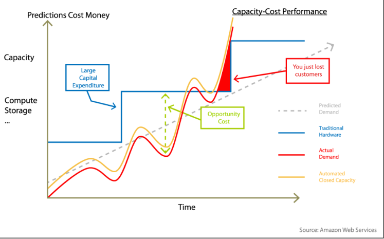
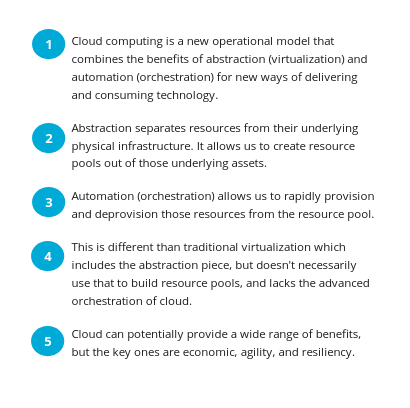

# Introduction and Cloud Architecture

## EC2 Story NOTES

* Amazon wanted to more efficiently use their resources.
* Cloud meant they didn't have to have dedicated capacity for each kind of system.
    * Just pull what's needed out of the pool
    * Still needed enough overall capacity for peak, so a lot of hardware wasn't being used day to day.
* Rent out the spare capacity (EC2)

### Resource Pools

Two keys in the resource pools:

1. abstraction
    * virtualization: hypervisors to separate virtualization from the physical hardware; software-defined networking; storage abstraction.

1. automation
    * orchestration: it is the magic behind the cloud computer. It is a way to coordinate the use of the resource in the resource pools. Main actions: provision, deprovision, resize.

### Static virtualization vs. Cloud Computing

* traditional virtualization
    * abstraction of compute, network, and storage from physical infrastructure.
    * a human administrator manually (mostly) allocates resources.
    * Not self-service. Administrator required.
    * Not elastic due to lack of automation

* Cloud Computing
    * Abstraction of compute, network, storage (and more) from physical infrastructure.
    * the cloud automates and orchestrates management of the resource pools.
    * self-service. users provision the resources from their own allocated pool based on policies.

### Defining cloud computing

NIST: Cloud computing is a model for enabling ubiquitous, convenient, on-demand network access to a shared pool of configurable computing resources (networks, servers, storage, applications, and services) that can be rapidly provisioned and released with minimal management effort or service provider interaction

ISO/IEC: Paradigm for enabling network access to a scalable and elastic pool of shareable physical or virtual resources with self-service provisioning and administration on-demand.

**What is cloud computing?**

Cloud separates (abstraction) application and information resources from the underlying infrastructure, and the mechanisms (orchestration) used to deliver them.

Cloud describes the use of a collection of services, applications, information, and infrastructure comprised of pools of compute, network, information, and storage resources.

These pools can be rapidly orchestrated, provisioned, implemented and decommissioned, and scaled up or down.

Cloud provides for an on-demand utility-like model of allocation and consumption.

### Potential benefits of cloud computing

Agility - Economics - Resiliency

* No capital expenditures (using public cloud)
* more agility
* unbounded scale
* improved resource utilization
* customer-controlled migration
* resilience
* pay for use

