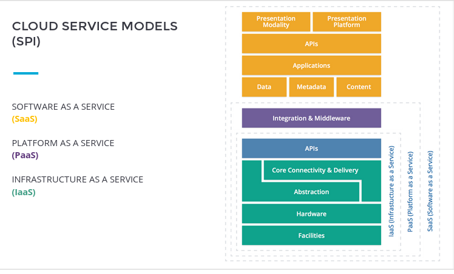
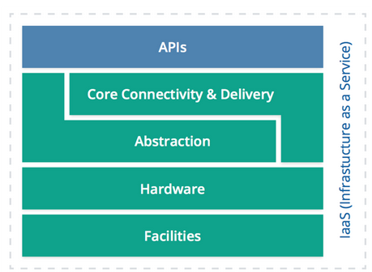
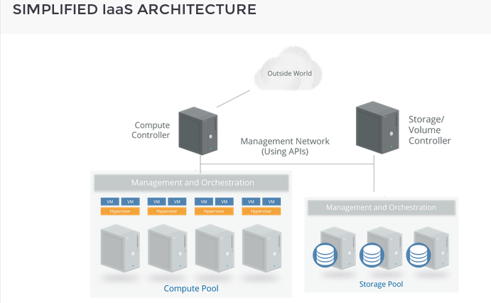
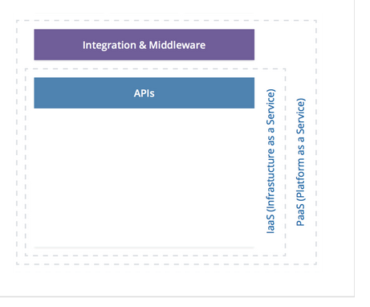
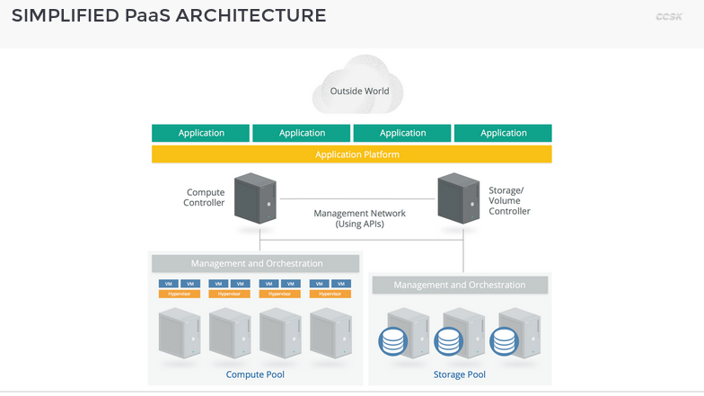
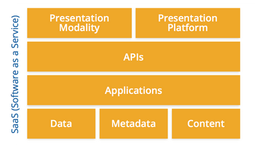
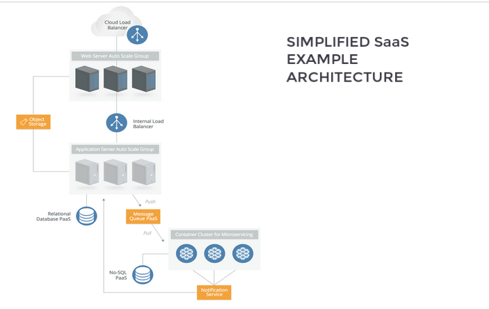
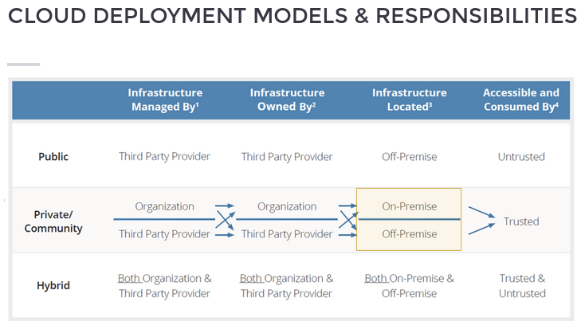
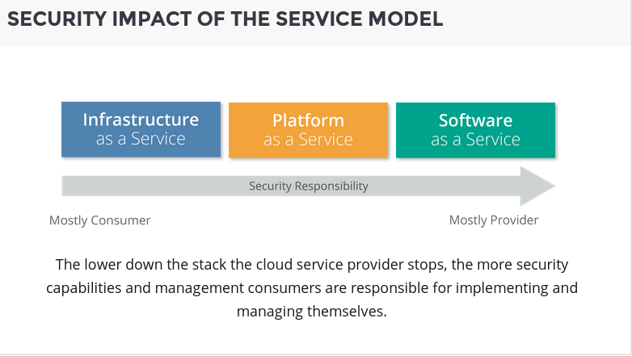

# Cloud Essential Characteristics

## NIST Model of Cloud Computing

### Essential Characteristics

Resource Pooling: Resources are pooled to serve multiple consumers using a multi-tenant model, which means different physical and virtual resources. Location independence, which means exact location of resources not in customer's control.

    * Broad Network Access: everything in the cloud is manager over the network.
        * Access through standard clients
            * Computers (desktops, laptops)
            * Mobile devices
        * Traditional or cloud-based software services (applications, processes, etc.)
    * Rapid Elasticity
        * services can be rapidly and elastically provisioned - in some cases, automatically - to quickly scale out; and rapidly released to quickly scale in.
    * Measured service
        * automatically control and optimize resource usage
        * leveraging a metering capability at some level of abstraction
        * utility computing - you pay for what you use.
    * On-demand self-service
        * a consumer can unilaterally provision computing capabilities, such as server time and network storage as needed automatically, without requiring human interaction with a service provider.

### Resources pooling and multi-tenancy 

Multi-tenancy is an emergent property of resource pooling. Once you have a pool and allow more than one consumer to access it, you have multitenancy. For multitenancy of a shared resource pool to work it needs a few characteristics and enforcement capabilities; all of which affect security.
    * **isolation**: consumers in one segment should never see anything running another segment. This is the core control that allows multiple tenants to safely share a resource pool without seeing or impacting each others' deployments.
    * **governance**: governance is the overall management model of the cloud, from contracts and service levels to policies. Many of the other characteristics are enforcement mechanisms of governance.
    * **service levels**: since a resource pool is a shared environment, the cloud provider needs mechanisms to divvy up the resources among tenants and assure them that they will have the resources that are promised. Service levels define who gets what resources.
    * **chargeback / billing models**: since the cloud controller needs to know exactly who is using what resources from the pool at all times, it is only natural this is metered and can be used for billing purposes.
    * **policy-driven enforcement**: policy-driven enforcement - the cloud provider and cloud consumers define how their environment should look and run using policies. These can be implemented in a user interface or directly via policies encoded using a formal policy language (code).
    * **segmentation**: customers run in their own *segment* of the cloud. Segmentation is how the provider divides the cloud up among different tenants.

### Conclusion
1. The NIST model of cloud computing cleanly describes the essential characteristics required for something to be considered *a cloud*.
1. The most important of those is resource pooling, which is what allows multiple consumers to share the same underlying physical resources.
1. But broad network access, elasticity, measured service, and self service are all also important and essential cloud features.
1. Thus multitenancy is an emergent property of resource pooling, not an essential characteristic itself.
1. For multitenancy to work it needs strong segregation (breaking up the environment) and isolation (the security boundary between segments)

## Service Models

* IaaS
    * the most foundational of the different services model
    * Lower level infrastructure
    * provisions processing, storage, networks, and other fundamental computing resources
    * consumer deploys and runs arbitrary software. It can include operating systems and applications.

    

     

* PaaS
    * Application development frameworks, middleware capabilities, and functions such databases, messaging, and queuing, notification services, email services.
    * Deploy consumer-created or acquired applications onto cloud infrastructure
    * Created using programming languages and tools supported by the cloud provider.

     

     

    
    

* SaaS
    * The consumer uses the provider's applications
    * Doesn't necessarily have to run on IaaS or PaaS, but must still have the Essential Characteristics.
    * The consumer does not manage or control the underlying cloud infrastructure including network, servers, operating systems, storage, or even individual application capabilities.

    

    

### Conclusion

1. Service models describe what is actually offered to a cloud consumer - infrastructure, a platform, or a complete application (software).
2. Infrastructure as a Service provides resource pools of virtualized infrastructure such as compute, network, or storage pools.
3. Platform as a Service further abstracts capabilities and provides resource pools of pre-configured services where the cloud consumer doesn't manage the underlying infrastructure. Such as databases, container platforms, message queues, and a wide range of other services.
4. Software as a Service fully abstracts everything except the application itself. Cloud consumers use the application but have no insight or management of the underlying resources.
5. In real-world deployments cloud consumers often mix and match the service models to meet project requirements.
    

## Deployment Models

1. **Public**: the cloud infrastructure **is made available to the general public or a large industry group** and is owned by an organization selling cloud services. This tends to be what most organizations view as the *cloud*. Basically a big set of computers in the sky that can be spun up or decommissioned instantly to support almost any kind of applications.
   
2. **Private**: the cloud infrastructure is operated solely for a single organization. It may be managed by the organization or a third party, and may exist on-premises or off-premises. Any infrastructure you are responsible for managing can be termed a *private cloud*. Thus your existing data center, given some of the essential characteristics of cloud infrastructure (brad network access, rapid elasticity, etc.) is sort of a private cloud. Of course, ,there is a lot of work to be done to turn a traditional existing data center into a private cloud facility, but it's definitely a direction many organizations are moving towards.

3. Hybrid: the cloud infrastructure is a composition of two or more clouds (private, community, or public) that remain unique entities but are bound together by standardized or proprietary technology that enables data and application portability (e.g. cloud bursting for load-balancing between clouds). Why have one, when you can be a little facetious, but hybrid models are real and provide both a shorter term migration plan (so you can support your existing data centers/private cloud, while moving some or all of your infrastructure to another cloud platform)

4. Community: the cloud infrastructure is made available to the general public or a large industry group and is owned by an organization selling cloud services. This tends to be what most organizations view as the *cloud*. Basically a big set of computers in the sky that can be spun up or decommissioned instantly to support almost any kind of applications.

### Logical Model

1. **infostructure**: Application deployed in the cloud and the underlying application services used to build them. For example, platform as a service features like message queues, artificial intelligence analysis, or notification services.
2. **applistructure**: the data and information. Content in a database, i.e. storage, etc. 
3. **metastructure** / management plane: the protocols and mechanisms that provide the interface between the infrastructure layer and the other layers. The glue that lies the technologies and enables management and configuration.
4. **infrastructure**: the core components of a computing system: compute, network, and storage. The foundation that every else is built on. The moving parts.

### Conclusion

1. Deployment models describe how the cloud (regardless of service model) is offered to consumers. The easiest way to think about it is *who gets to use the cloud?*
2. Public clouds are open to anyone who signs up for the service, which means different cloud consumers do not know or trust each other and the cloud provider is responsible for keeping them isolared.
3. Private and community clouds are reserved only for trusted users; those from the same organization or a group of trusted organizations. Someone eslse can still own and operate the cloud, but only the trusted users are allowed.
4. Hybrid cloud connects on premise resources to a public cloud deployment.
5. The logical model is a different way of describe how we distribute our resources and application components and is useful in showing how data, infrastructure, application, or management components are organized across environments.

## Shared Responsibilities

### Shared responsibilities model

1. Provider
   * Physical infrastructure
   * virtualization / abstraction
   * application and PaaS Services
2. Management Plane / Metastructure
3. Consumer
   * Host / Server Security
   * Network, IAM, and Metastructure configuration security
   * data and application security

### Security Impact of the Service Model

Security considerations break down to:

* How does the underlying technology affect security controls?
* Who will consume assets, resources, information?
* Who is responsible for governance, security, and compliance?

**Workflow**

1. Identify requirements
2. Select provider, service, and deployment models
3. Define Architecture
4. Asses Security Controls
5. Identify Control Gaps
6. Design and Implement Controls
7. Manage Changes

### Conclusion

1. Cloud describes the use of pools of compute, network, information, and storage resources.
2. Characteristics of cloud services include: broad network access, rapid elasticity, measured service, on-demand self service, and resource pooling.
3. Cloud services tend to be delivered as infrastructure as a Service (IaaS), Platform as a Service (PaaS), or Software as a Service (SaaS), though the distinctions are blurring.
4. Cloud service can be deployed as public, private, hybrid or community clouds depending on the security and sharing requirements of the application.