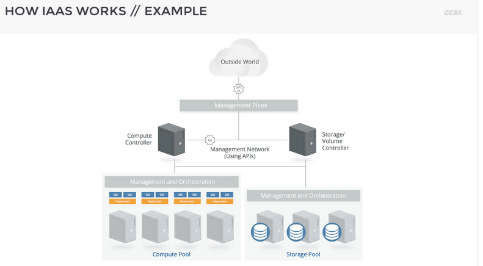
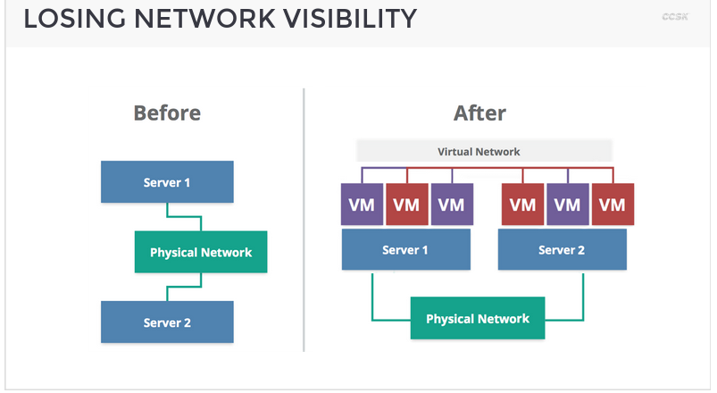
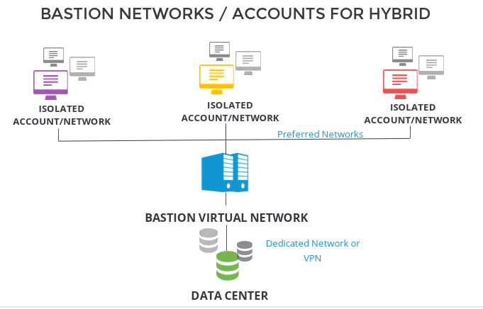
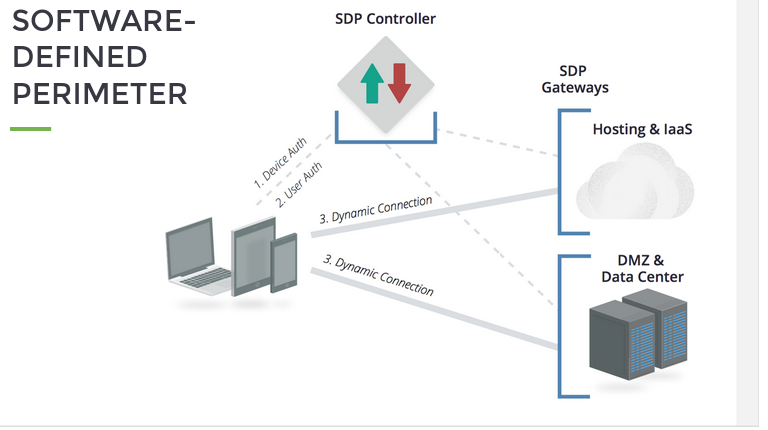
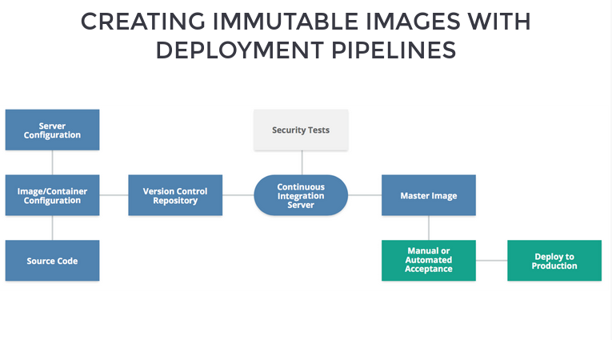
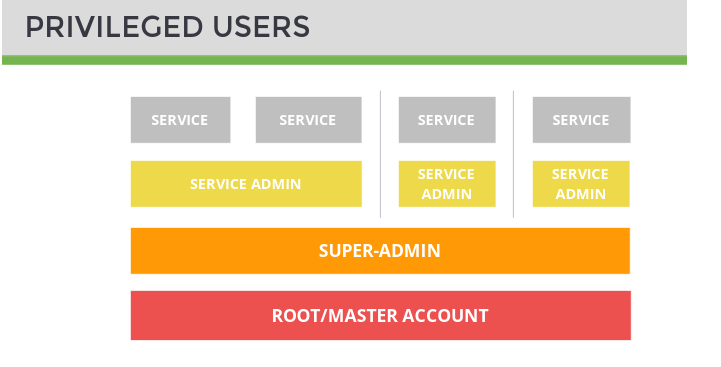

# Cloud Security

## 2.1 Infrastructure Security for Cloud Computing

### Module structure

Objectives

* Understand the components of cloud infrastructure
* Assess the security implications of virtual networks and workloads
* learn the security advantages and disadvantages of working with cloud infrastructure
* evaluate how to secure the cloud management plane
* learn how to manage business continuity for cloud computing

## 2.2 intro to Infrastructure security for Cloud Computing

### Macro Layers

* Management plane
* virtualized infrastructure
* base infrastructure

* Cloud security
  * infrastructure components
  * hypervisors
  * network
  * management plane

* Reduced capital expenditures
* Better agility and resiliency
* Better economic benefits
* Better security benefits

**How IaaS works, example**

### Public and Private

* If you run your own private cloud, you're responsible for all of this.
* In a public cloud, you only control what you consume, plus a little management.

### Simplified infrastructure components

1. Controller
    * API Server
    * Message Queue
    * Database
2. Computer
   * Hypervisors
3. Network
   * SDN Manager
   * DHCP
   * Security Groups
4. Storage
   * Volume management
   * Raw Storage

Under 1 and 2 there is a image service (different virtual operation system)
Under 3 and 4 there ia a identity service

**All of these core components need to be securely configured, patched, hardened, and maintained.**

### Securing cloud infrastructure, first approach

1. Harden hosts
2. Harden infrastructure
3. Secure networks
4. Secure Architecture
5. Harden Management Plane

### Conclusion

1. **Infrastructure security includes all of the underlying physical resources and the software, like operating systems, that runs on them**.
2. **With private cloud you are responsible for securing all of the hardware and software that makes up the cloud platform**. With **public cloud** **you are only responsible for what you deploy in the cloud**.
3. Cloud platforms, **especially private cloud, are often built using common components including operating system, message queues, and databases**. **All of these need to be properly secured**.
4. Security cloud infrastructure **starts with proper design, then hardening of the base systems, the various services, and eventually the management plane**.

## 2.3 Software Defined Network

* Underlying IaaS Networks
* Building Underlying Networks for Cloud
* Virtual Network
* Major Virtual Network Types
* Software-Defined Networking (SDN)
  * SDN Security Benefits
  * SDN Firewalls / Security Groups

### Underlying IaaS networks

At least three networks for three different traffics.

* Management
  * Management plane to nodes
* Storage
  * Storage nodes (volumes) to compute node (instances)
* Service
  * Internet to compute nodes; instances to instances
  
### Building underlying networks for clouds

* use separate physical networks
  * don't rely on VLANs
  * SDN may be a good option, but depends on the version and the hardware you use. Physical separation is still preferred, as much for performance as security.
* isolate the cloud networks from the LAN
  * there should be only two outside connections
    * the network manager to route internet traffic.
    * the management and web and API server

### Virtual networks

* virtual networks and security
  * virtual networks are subject to the same security concerns of a physical network.
  * virtual networks always run on a physical network.
* virtual networks may provide a simpler stack to build the private cloud
  * greater control is afforded through SDN
* Virtual networks may include inherent security capabilities.

### Major virtual network types

* **VLAN**
  * Leverage existing technology available in essentially all networks
  * Designed for **network segregation, not isolation**, **in single-tenant environments**
  * **Not effective as a security barrier**
  * Have performance and address space limitations at cloud scale
* **SDN**
  * Software defined networks **decouple the network control plane from the underlying hardware**
  * **Abstracts virtual networking from traditional LAN limitations**
  * **Extremely flexible** (e.g. overlapping IP address ranges on same physical hardware)
  * multiple implementations, both standard and proprietary
  * **Can create effective security barriers**

**More about SDN**
* Provides a decoupled control plane that is (potentially) easier to secure.
* openflow is an example of a SDN
* Remote access is controlled by the Administrator
* different flavors support different capabilities, but generally they can couple tightly with the cloud platform and possibly security tools
* Nearly all implementations are API-enable
* while they may look like a regular network to the cloud consumer, they function very differently
* rely heavily on packet encapsulation

**SDN Benefits**
* Easier isolation
* Topology not limited to physical structure
  * You can put multiple overlapping virtual networks, even with the same address ranges, on the same physical network
* SND firewalls / security groups
  * default deny
  * orchestrated
  * granularity of host firewall with manageability of a network appliance
* **Security policies and controls based on tags and other context**

**SDN Firewalls / Security Groups**

* Policy-based
  * * not necessarily tied to IP address
  * can include context/tagging and other intelligence
* No additional hardware or software to deploy
* Typically default-deny
  * Even assets in the same security group can't communicate
* Apply on a per-asset level (instance or PaaS object)
  * but managed outside that asset. For example, if a virtual machine is compromised that can't be used to disable the firewall
* Integrated into core SDN logic
  * traffic/packets simply dropped if they don't match the policy's rules
  * Tightly coupled with the cloud orchestration so fully capable of keeping up with high velocity changes

### Conclusion

1. Cloud platforms typically rely on three physical networks (at minimum). One for management, one for storage, and one for traffic between resources.
2. The two most common virtual networking technologies used in cloud are VLANs and Software Defined Networks. For security, SDNs are preferred since they provide better isolation and security.
3. SDNs decouple the control plane from the underlying physical network and provide tremendous flexibility. They are capable, for example, of deploying the same IP address range across isolated networks on the same physical hardware.
4. Security groups is the common name for the firewalling built into SDNs. They can provide the manageability of a network firewall with the granularity of a host firewall.

## Cloud Network Security

### Controlling blast radius with virtual networks and cloud account / subaccount / subscruption isolation

* Leveraging inheriting isolation of cloud environment to reduce the blast radius. It is possible in different levels.
  * each account cloud is isolated
  * subnetworks
  * security groups
  * all of these reduce the blast radius

### Losing network visibility

* It is not possible monitoring virtual network the same physical network.
* in the classical configuration all servers and hosts were connected in the physical network.
* In a virtual network, there are multiple VMs, run over multiples servers, on a physical network.

### Cloud Network Security

* 3rd party security tools, advantages and disadvantages
  * Physical appliances
    * unusable in public cloud
    * lack visibility into virtual networks
    * if used, require highly inefficient routing and topologies
    * typically incapable of keeping up with cloud rates of change
  * virtual appliances
    * become bottlenecks
    * may materially increase cloud costs due to resource requirements
    * must support autoscaling, elastic pricing, and other cloud native orchestration
    * must support high rates of change (IP address velocity)
  * host software
    * typically better suited to cloud topologies and rates of change
    * must be consistently embedded in images/virtual machines
    * will add to local resource requirements
      * Agents should be designed for cloud,
      * lightweight, and cloud-aware
    * must communicate and save data externally.

### Bastion networks / accounts for hybrid

* Bastion network (TRANSIT VPC) is the way to connect data center.
* Three isolated account/network can't communicate each other, but can communicate with bastion virtual network.

### SDP - Software-Defined Perimeter

### Provider and Consumer responsibilities

* Provider
  * Security of the virtualization technology
  * exposing security controls (e.g., security groups)
  * disabling attack surface (e.g., packet sniffing)
  * securing the virtual management infrastructure
* consumer
  * proper virtual network design
  * implementing virtual security control (e.g., security groups)
  * securing their portion of the management plane/metastructure (e.g., proper IAM)

### Conclusion

1. Prefer SDN when available
2. Use SDN capabilities for multiple virtual networks and multiple cloud accounts/segments to increase network isolation
3. Separate accounts and virtual networks dramatically limit blast radius compared to traditional data centers
4. Implement default deny with cloud firewalls
5. Apply cloud firewall on a per-workload basis as opposed to a per-network basis
6. Always restrict traffic between workloads in the same virtual subnet using a cloud firewall (security group) policy whenever possible.
7. Minimize dependency on virtual appliances that restrict elasticity or cause performance bottlenecks

## Securing Compute Workloads

### Workloads in Cloud
* Virtual Machines
* Containers
* Serverless
* Function as a Service
* Store procedure in a DB. Storage procedures on PaaS

Security controls will vary, but in general
* Configure the environment/features securely
* Application security fundamentals still apply, but may need to be implemented at a different layer (e.g., within the code/workload)
* monitoring/logging will change significantly.

### Impact on traditional workload security controls

* Controls
  * May not be able to run agents (e.g., av)
  * *traditional* agents may not work properly in cloud or will impede performance
  * Agents must be cloud aware
    * e.g., not rely on static IP addresses and capable of communicating across virtual network boundaries
  * Agents should be lightweight and support autoscaling and autoregistrations
  * Agents should not increase attack surface
    * e.g., require ports to be open for management
* Monitoring
  * network addresses are not sufficient to identify a workload in the cloud
  * logs should be offloaded quickly due to more-ephemeral nature of cloud workloads
  * logging architectures should be redesigned to account for cloud topology and variable costs of different storage tiers
    * cascading log collection is generally preferred. Collect locally in object storage and use filtering tools to migrate security-sensitive logs to central collection and management
* Assessment
  * Providers often limit vulnerability assessment
  * default deny networks may further limit network assessment effectiveness
  * host assessment (agents) if often preferable
  * assess images rather than instances when using immutable

### Immutable workloads enable security

Comparison:

* Standard / long running
  * managed just like traditional servers
* automated configuration management
  * the virtual machine is automatically configured using a template/policy based tool (e.g., Chef, Puppet/Ansible/Salt)
  * it changes, but manual changes disable since the automation would overwrite
* immutable
  * based on images and automatically deployed (e.g. by an auto scale group)
  * login disabled since changes won't propagate to other instances
  * you replace with new versions instead of patching/updating old versions
  * very easy to harden for security (e.g. disable SSG)

Up to bottom increase relative security.

### Creating immutable images with deployment pipelines

### Provider and consumer responsibilities

* Provider
  * workload isolation
  * underlying infrastructure security
  * securing the virtualization technology
  * providing consumers adequate security controls
  * protecting volatile memory
* consumer
  * security settings
  * monitoring and logging
  * image asset management
  * use dedicated hosting if needed and available
  * all in-workload security controls (e.g., patching virtual machines)

### compute security recommendations

* leverage immutable workloads whenever possible
  * disable remote access
  * integrate security testing into image creation
  * alarm with file integrity monitoring
  * patch by updating images, not patching running instances
  * choose security agents that are cloud-aware and minimize performance impact, if needed
* maintain security controls for long-running workloads, but use tools that are cloud aware
* store logs external to workloads
* understand and comply with cloud provider limitations on vulnerability assessments and penetration testing

### conclusion

1. disable remote access
2. integrate security testing into image creation
3. alarm with file integrity monitoring
4. patch by updating images, not patching running instances
5. apply cloud firewalls on a per-workload basis as opposed to a per-network basis
6. choose security agents that are cloud-aware and minimize performance impact, if needed
7. maintain security controls for long-running workloads, but use tools that are cloud aware
8. store logs external to workloads
9. understand and comply with cloud provider limitations on vulnerability assessments and penetrations testing

## Management Plane Security

### The management plane

It is how do you access and controle your cloud. It is the manager structure and manages everything in the cloud.

Key Functions
* provisioning resources
* starting/stopping/terminating resources
* configuring resources

Security Consideration
* authentication
* access control
* logging/monitoring

**The management plane is the literal key to your private cloud.** Access mehtods: web console, API (usually REST);

* Diferent providers / platforms use different authentication optinos
  * we cover some of these in more depth in the Identity Management section
* web console logins are typically like logging into any other web service
  * username and password
  * maybe MFA
* APIs use multiple techniques that may or may not have cedentials different from the web console
  * HTTP request signing (crypto using keys)
  * tokens
  * oauth/saml
* All connections should always use TLS

**Secure root account!**, it is the most sensible credential.
**Manage non-root users**
**Enabling monitoring / auditing**

### the root account security

* Enable hardware multi-factor authentication (MFA)
  * Store in a locked, central location
* Use isolated credentials (a designated email or user account not used for anything else)
  * Use a name with a random seed if possible to reduce phishing
* If available, use account security questions
  * Record and store securely
* Never use account except for emergencies

### Cloud IAM Management

* Role-based access control (RBAC)
* Variable granularity across providers/pratforms
* Variable granularity within product lines
* Look for ability to integrate w/SSO or directory services
* Investigate third-party tools

### Privileged users

### Monitoring and Auditing

* Cloud side
  * Logs all API and internal activity
  * Best option when available
  * Pull logs to secure, central location
* Portal/Proxy
  * Route users through a portal, they don't have direct credentials
  * Misses internal activity or compromised creds
  * May be the only option
  * CASB tools often used for SaaS (we discuss later) Host / Network Logs

### Conclusion
1. The management plane is how you manage your cloud deployments. It's the biggest difference from traditional infrastructure security, and the most critical piece to protect.
2. Nearly all clouds support both web console and API access to the management plane. When running your own cloud it's critical to make sure these are effectively locked down.
3. Management planes support different kinds of credentials, all of which must be managed securely.
4. Always start by securing the root or master account since losing control of that means losing complete control over your cloud deployment.
5. Enforce least privilege when setting up your other priviled users and adminsitrators.
6. Always use multifactor authenticatino for all cloud accounts, especially privileged users.

## Business Continuity and Disaster Recovery

### Architect for failure

Design for your platform(s) and don't expect existing architectures to lift and shift without compromise.

### Key Aspects of BC/DR

1. Continuity within the Provider/Platform
2. Preparing for and Managing Cloud Provider Outages
3. Portability

### Cover the entire stack

1. Metastructure/management plane
  * the cloud configuration
  * IAM, monitoring, and other in-cloud management controls and compliance artifacts
  * software defined infrastructure is a key tool
2. Infrastructure
  * core configuration
  * leverage platform/provider resiliency capabilitues rather than building from scratch inside VMs
3. Infostructure
  *  leverage "resilient" provider storage (e.g. most object storage is highly resilient)
  *  keep backups/snapshots within the provider for rapid restore
  *  always use lowest cost storage and transfer mechanisms within and between providers
4. Applistructure
  * understand PaaS limitations and lock-in, including the historical availability of services
  * downtime is nearly always an option - have realistic standards
  * adopt chaos engineering

* Architect for failure
* Take a risk-based approach
* Design for high availability in your cloud provider
  * Take advantage of availability zones. PaaS components, and data backups.

BC/DR in the cloud
* Architecture for failure.
* Take a risk-based approach to everything.
  * Even when you assume the worst, it doesn't mean you can afford or need to keep full availability if the worst happens.
* Design for High availability within your cloud provider
  * In IaaS and PaaS, this is often easier and more cost effective than the equivalent in traditional infrastructure
  * take advantage of provider-specific features
  * understand provider history, capabilities, and limitations
  * cross-location should always be considered, but beware of costs depending on availability requirements
  * also ensure things like images and asset IDs are converted to work in the different locations.
  * business continuity for metastructure is as important as that for assets.
* Prepare for graceful failure in case of a cloud provider outage.
  * This can include plans for interoperability and portability with other cloud providers or a different region with your current provider.
  * for super-high-availability applications, start with cross-location BC before attempting cross-provider BC
  * Cloud providers, including private cloud, must provide the highest levels of availability and mechanisms for customers/users to manage aspects of their own availability

* Conclusion
1. The first rule of cloud is to architecture for failure. Since any individual virtual resource may be less resilient, cloud provides and platforms have built in tools to improve systemic resilience. But fail to use these and you are more likely to experience an outage.
2. The two major areas to focus on are resiliency within your cloud provider, then resiliency if your provider goes down. Portability can play a role here but don't get so hung up on it that you become paralized and can't use all of the capabilities of your platform or provider.
3. Your BC/DR should cover the entire stack of the logical model- from the metastructure / management plane and infrastructure to your data and application architecture.
   

