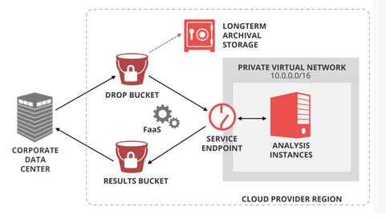
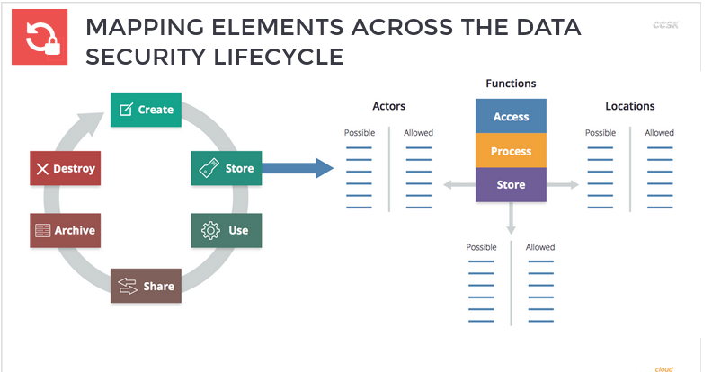

# Data Security for Cloud Computing

## Introduction

Domain 6: management plane and business continuity
Domain 11: data security

Covers the following subject areas
* cloud data architectures
* data security and encryption
* CASB and data loss prevention
* BC/DR

## Cloud data storage and data moving to the cloud

* How Cloud Storage is Different because of abstraction/virtualization
* Storage: not-off-the-shelf technologies
* Security: controls, encryption

* all data is eventually stored on a physical device, but cloud platforms use multiple types of data storage virtualization to abstract and build storage pools
  * these are not necessarily off-the-shelf technologies that map to traditional data storage virtualization, like SAN, NAS, that are well known
* this storage may be expressed / exposed like traditional storage but under the hood is quite different
  * Just like SDN
* Security focuses on access controls, encryption, and proper configuration

### Major Cloud Data Storage Types

* Volume
  * essentially, virtual hard drives for VMs/Instances
* Object
  * resilient file storage via API
  * not normal filesystems. Closer to a "database for files"
* database
  * includes relational and non-relational
  * not merely a DB running on an instance
* application / platform
  * everything from a content delivery network to a SaaS application that includes file storage as a feature

### Data Dispersion (Bit-splitting)

It is a technique that is commonly used to improve data security, but without the use of encryption mechanisms.

Data dispersion is much like traditional RAID technologies; spreading the data across different storage areas and potentially different cloud providers spread across geo boundaries.

Bit splitting is like adding encryption to RAID. The data is first encrypted, then separated into pieces, and the pieces are distributed across several storage areas.

Take any give file, then fragment them and distribute trough many storages in many servers;
Many copies of the same file;
Many copies of fragments file;

### Manage data migrating to the cloud

It is a multi-step processes;
1. discovery process
2. DAM: database access monitoring
3. CASB: Cloud Access Security Brokers
4. DLP: Data Loss Prevention
5. URL: Uniform Resource Locator Filtering

#### CASB: Cloud Access and Security Brokers

* Discovery
  * What cloud services are employees using?
    * DNS records
    * URL filters
    * security web gateways
  * can block access
* Monitor
  * auditability of cloud services
  * SaaS especially lacks the ability to monitor what employees are doing
  * CASB monitors traffic from outside
* Protect
  * provides security controls
  * generic or more specific controls for cloud providers

* How does these tools connect?
  * API: cloud providers don't always have access to APIs
  * Inline/Proxy: via CASB in the cloud. Problematic, last resort if API doesn't work, but can work for SaaS
  * Inline/Local

### Protecting data as it moves

* encrypt before you send it
* encrypt as you transfer it
* encrypt as you transfer it, through a proxy

### Conclusion

* data stored in the cloud may use a range of different abstraction and virtualization technologies. To the user these may look like traditional storage, but behind the scenes the mechanisms will be quite different. However, all data is still eventually stored on physical media
* volume storage is virtual hard drives, while object storage is like a database for filers that is managed via APIs. Databases in the cloud may be multitenant and don't necessarily work like on-premise database systems. Cloud applications may store files using a wide range of techniques that the cloud consumer has no insight into.
* most cloud storage uses data dispersion for resilience, which breaks our traditional ties to knowing the physical location of drives
* tools like CASB, DLP, and even URL filtering can help us visualize or manage data migrating to the cloud
* data can be encrypted before migrating to the cloud, protected in transit with TLS or other network encryption, and may be consolidated and encrypted through an on-premise proxy, especially for cloud-backed backups.

## securing data in the cloud

* Access controls is always your first data security control
  * most foundational security controls
    * different areas - management plane
    * different sharing controls
    * app-level controls
  * granularity of access controls varies between providers
    * finer-grained the access controls the better for security, but the harder for manageability
  * controls may look the same, but they're not the same!

### Conclusion

* access controls are the most fundamental security control, even in cloud computing
* there is massive variability of available access controls between cloud providers, and cloud storage may offer new categories of controls, such as sharing, beyond those in more-traditional storage
* an entitlement matrix is the documentation of authorizations, It defines who should be allowed to not only access data, but what they should be allowed to do with it.

## encryption for IaaS

Cloud data encryption layers
* Application
* Database
* File/API
* Volume Storage

Cloud Encryption System Matrix

KEYS + Encryption Engine + Data

Where is the key?
Where is the encryption engine?
Where is the data?

It is a good practice separate Key MGMT Service from the Encryption Engine in distinct VMs

* there are multiple layers where you can encrypt, each with benefits and complications. Encrypting higher in the application stack is often best for discreet data, while lower-level encryption, like volume, is better for bulk data
* encryption systems are composed of the data, the encryption engine, and the key management, where you place these determines the architecture and affects the security of the system
* whenever possible, you want to separate the encryption key from the data and the encryption engine
* for object storage encryption, you can encrypt the data on the client site, the server side (using multiple techniques), or even through storage proxies (which we frequently see used for site backups)

## encryption for PaaS and SaaS

### PaaS
* Encrypting Platform as a Service
  * Applications layer
    * encrypt within your app code
    * encrypt before sending to the platform
    * could keys be exposed?
    * ask questions of cloud provider
  * Database layer
    * transparent database encryption (TDE)
      * key management
    * field-level
  * Others
    * Message queues, notification services
      * different encryption options
    * Bring Your Own Key

Issues in Encrypting Platform as a Service
* key exposures
* volatile memory
* swap files
* for providers: use per-customer keys

Where is the key?
Where is the data?
Where is the encryption engine?

### SaaS

* Provider managed
  * Provider-managed may offer customer managed keys
* Customer managed
  * Proxy encryption requires an external tool or service
    * You re-route SaaS traffic to the proxy before it is sent to your SaaS provider
    * This encryption typically breaks SaaS applications, often dramatically reducing capabilities

* Platform as a Service encryption will depend almost completely on the kind of platform and options supported by your provider. For workloads though, you can nearly always program your own encryption at the application layer
* when encrypting in your application, you can handle the encryption in your own code or send it off to an external encryption server or service
* For SaaS you only have two options - rely on your provider's supported encryption, or use a 3rd-party encryption proxy that sits as a man in the middle
* SaaS encryption proxies may introduces new security concerns due to requiring you to break any network encryption to the cloud provider. They may also break application functionality. However, there are still valid use cases, albeit limited.

## encryption key management

Cloud key management techniques

* HSM / APPLIANCE
* Virtual Appliance / Software
* HYBRID
* Cloud Provider Service

### Provider Key Management and BYOK

Provider Encryption and Risk
* Providers encrypt customer data in their organizations, it's built into their platform
  * customers can sometimes hook into it
* You control the key
  * Customer management Encryption, or Bring Your Own Key (BYOK)
* Provider has no access to your data
* shared responsibilities model

Layers of Key Management

BYOK is not always an option
Varying security implications for different BYOK implementations

* Some providers build encryption into their platform. By default they typically manage keys for you
  * e.g., the checkbox to encrypt an S3 bucket, or the default encryption on box/dropbox
* some providers now allow you to manage your own keys. Bring your own key
  * to varying degrees of security. Some are fully under your control, others the provider can technically get to, but they provide separation of duties

* Provider managed
    * cloud provider manages encryption
    * the customer owns the keys, but the provider may manage
      * this is not necessarily insecure, it all depends on the provider's security controls
      * providers should be very transparent about these
* 3rd-party customer managed
  * you own the keys, provider may manage
  * encryption management and data storage is handled by cloud provider
  * keys may be exposed at some level, but typically data encryption keys, not master keys
  * often good option for SaaS and PaaS
* Customer Key Manager
  * virtual appliance option
  * you manage keys and encryption
  * good for IaaS, does not integrate well with cloud provider services
  * can cause issues w/ PaaS and not an option with SaaS
* HSM
  * in hybrid cloud scenarios you can own your physical HSM
  * can be available via API

How do you make your decision?

### Conclusion

* proper key management is essential to effective encryption, and we have more options at our disposal in cloud computing
* HSMs and physical appliances may be offered by your cloud provider, or you can look at deploying software or virtual appliances in the cloud, connecting to existing hardware over a hybrid connection, or even leverage new options like a key management service from your cloud provider or a 3rd-party
* providers offer a range of key management option, from the provider completely managing the keys, to allowing you to manage your own keys in their environment or even provide keys as needed
* bring your own key will work differently on different providers and services, with varying levels of relative security
* the final choice will come down to your risk and threat models. Once you know the risk you are trying to prevent, you can evaluate the technical options in your provider and platform of choice. Remember, not all data needs the same level of security so you do not always need to default to the most secure option.

## other data security options

* Data security architecture
  * this example shows using a private network for data processing without ever exposing servers to the internet
  * good architectural decisions can optimize security
  * performance advantages: no servers running, no instances, no virtual machines - you only pay for batch jobs, archival storage, and object storage
  * there's no attack path

* Data security controls
  * auditing, monitoring, alerting
    * can build in alerts
    * audit logs
    * what capabilities are available for different kinds of data?
  * Provider-specific controls
    * wide range of platform/provider-specific controls
  * data loss prevention (DLP)
    * shows up in SaaS, PaaS, not so much IaaS
    * 3rd-party tools: DLP itself, or CASB (Cloud Access and Security Brokers)
    * useful for office productivity side, not datacenter

* Enterprise Rights Management / Digital Rights
  * Management (ERM/DRM)
    * ERM "light"
      * not full DRM, but has similar capabilities

### More than encryption

* Auditing / Monitoring / Alerting
  * collect at the provider / metastructure/management plane and the data storage level when possible
* Provider specific controls
  * various providers and platforms have their own data security controls that may not fit our categories
* Data loss prevention
  * typically a SaaS (and maybe PaaS) priority, don't see much in IaaS
  * CASB often best bet, and may integrate with dedicated DLP tools
  * cloud  providers sometimes offer basic DLP in the platform (mostly file collaboration products)
* ERM / DRM
  * full DRM not often seen and not a cloud-specific issue. Will break most SaaS
  * Providers may offer DRM-like capabilities (e.g., user + device + content restrictions)

### Conclusion

* integrating PaaS and other new cloud architectural options into applications and data storage may allow cloud consumers to shift more security burden onto cloud providers and reduce the stack's attack surface
* good activity monitoring and alerting are important to cloud data security, and providers may also support a variety of additional security controls
* data loss prevention tends to be more useful for SaaS and may be integrated into CASB tools
* traditional DRM/ERN is not necessarily useful for cloud, but some SaaS/PaaS services may have DRM-like capabilities such as sharing or view controls that provide similar protections
* data masking is critical for test data generation and to ensure production data is not exposed in development environments.

## data security lifecycle

* Data security lifecycle
  * it's a way of thinking about data security
    * where is your data?
    * how does it move?
    * how do you access it?
    * what are the exposures?
    * where can you put a security control?

* data security lifecycle is a tool to help you model your security controls
* don't get too granular or it will be too complex to model. Focus on the big picture
* use the lifecycle to determine where data flows
* then use it to map how data *can* be used, and how it *should* be used
* when you can do something that should not be allowed, that's where you need to insert a security control

* data security lifecycle
  * create: 
  * store:
  * use:
  * share:
  * archive:
  * destroy

* recommendations
  * understand the specific capabilities of the cloud platform you are using
  * do not dismiss cloud provider data security. In many cases it is more secure than building your own, and comes at a lower cost
  * create an entitlement matrix for determining access controls. Enforcement will vary based on cloud provider capabilities
  * consider CASB to monitor data flowing into SaaS. It may still be helpful for some PaaS and IaaS, but rely more on existing policies and data repository security for those types of large migrations
  * use the appropriate encryption option based on the threat model for your data, business, and technical requirements.
  * consider use of provider-managed encryption and storage options. Where possible, use a customer-managed key
  * leverage architecture to improve data security. Do not rely completely on access controls and encryption
  * ensure both API and data-level monitoring are in place, and that logs meet compliance and lifecycle policy requirements
  * standards exist to help establish good security and the proper use of encryption and key management techniques and processes. Specifically NIST SP-800-57, ANSI X9.69 and X9.73

### Conclusion

* the data security lifecycle is a tool to help us visualize how our data is used and exposed, and can be helpful in determining where to place security controls
* the lifecycle itself consists of six phases from creation to destruction, but practically speaking data will bounce between all the phases as it is used. However, each phase has a distinct set of potential associated security issues and controls
* data will move between various locations, and be accessed using a variety of devices, users, and services. Mapping these can be useful in designing security controls
* depending on the location, phase, etc, the data will have a set of potential actors, functions, and locations. We map those against what we want to allow, and use security controls to pare the potential list to the allowed list
* we can encode this into an entitlement matrix which we then implement as security controls, such as access controls
